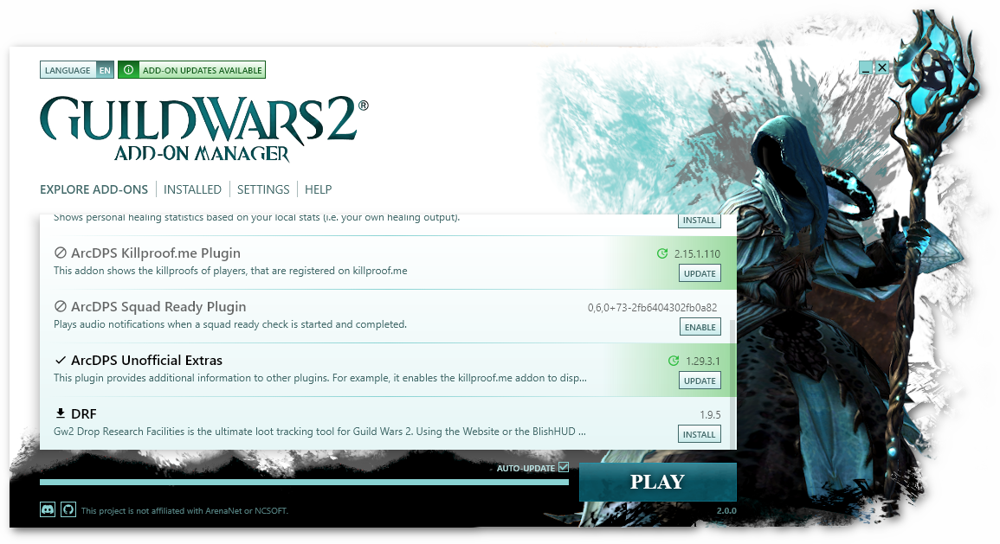

# Guild Wars 2 Add-on Manager

The Guild Wars 2 Add-on Manager is a tool that allows you to easily manage and
update third-party add-ons for Guild Wars 2.



> [!IMPORTANT]  
> This project is not yet ready for general use and still requires manual setup.

In order to use the manager, an up-to-date version of [GW2Load](https://github.com/gw2-addon-loader/GW2Load)
is required. The manager expects GW2Load to be installed in the game directory.


## Building from source

Refer to the development documentation for information on how to build the
project from source.

## License

### Disclaimer

This is an **unofficial** tool. The author of this project is not associated
with ArenaNet nor with any of its partners. Modifying Guild Wars 2 through any
third party software is not supported by ArenaNet nor by any of its partners. By
using this software, you agree that it is at your own risk and that you assume
all responsibility. There is no warranty for using this software.

--------------------------------------------------------------------------------

#### Guild Wars 2 Add-on Manager

```
GW2AddonManager
Copyright (C) 2024 Leon Linhart

This program is free software: you can redistribute it and/or modify it under
the terms of version 3 of the GNU Lesser General Public License as published
by the Free Software Foundation.

This program is distributed in the hope that it will be useful, but WITHOUT
ANY WARRANTY; without even the implied warranty of MERCHANTABILITY or FITNESS
FOR A PARTICULAR PURPOSE. See the GNU Lesser General Public License for more
details.

You should have received a copy of the GNU Lesser General Public License
along with this program. If not, see <https://www.gnu.org/licenses/>.
```

--------------------------------------------------------------------------------

#### Guild Wars 2

> © ArenaNet LLC. All rights reserved. NCSOFT, ArenaNet, Guild Wars, Guild
> Wars 2, GW2, Guild Wars 2: Heart of Thorns, Guild Wars 2: Path of Fire, Guild
> Wars 2: End of Dragons, and Guild Wars 2: Secrets of the Obscure and all
> associated logos, designs, and composite marks are trademarks or registered
> trademarks of NCSOFT Corporation.

As taken from [Guild Wars 2 Content Terms of Use](https://www.guildwars2.com/en/legal/guild-wars-2-content-terms-of-use/)
on 2024-01-23 00:57 CET.

For further information please refer to [LICENSE](LICENSE).
